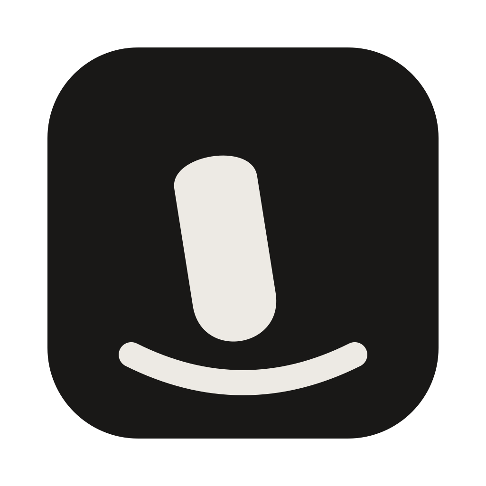

<div align="center">
  <!-- NB: icon.svg carries ~10% macOS canvas padding (100px on 1024),
       so 144 renders at ~115 optical px, matching a 128 tight crop. -->
  

  <h1>Tappy</h1>
  <p><b>Knock on your MacBook. Something happens.</b><br />
  A menu-bar app that turns physical taps on your Mac's body into actions.</p>
</div>

<p align="center">
  <a href="https://trytappy.app"></a>
  <a href="https://github.com/DeaDoes/Tappy/releases/latest"></a>
  <a href="https://github.com/DeaDoes/Tappy/blob/main/LICENSE"></a>
  <a href="https://github.com/DeaDoes/Tappy/actions/workflows/ci.yml"></a>
  <a href="https://github.com/DeaDoes/Tappy/stargazers"></a>
  
  
  
</p>

<p align="center">
  <a href="https://trytappy.app"><b>Download</b></a> ·
  <a href="#-features">Features</a> ·
  <a href="#-how-it-works">How it works</a> ·
  <a href="#-install">Install</a> ·
  <a href="#-build-from-source">Build</a> ·
  <a href="CONTRIBUTING.md">Contributing</a> ·
  <a href="#-faq">FAQ</a>
</p>

---

## ✨ Features

- **Single, double & triple knock** — each maps to any action you want.
- **Custom rhythms** — knock a pattern once, Tappy learns the timing and matches it later within your tolerance.
- **Rich action library:**

| Category | Actions |
|---|---|
| **Essentials** | Copy, paste, undo, redo |
| **Get Stuff Done** | Screenshot (full / area), lock screen, sleep, mute, volume |
| **Navigation** | Mission Control, Spaces, Spotlight, tab switching, app switcher |
| **Automation** | Open app / file / URL, run a Shortcut, run a shell command |
| **Reactions** | On-screen glitch, shockwave, flash, custom text |

- **No microphone.** Reads the built-in accelerometer as a raw `IOHIDDevice` — no recording, no mic permission, nothing to leak.
- **Typing-safe.** A tap only counts after 1s of keyboard silence, so typing never triggers actions.
- **Lightweight & private.** Zero dependencies, menu-bar only, auto-updates with signature verification.

## 🔭 How it works

Tappy reads the **built-in accelerometer** as a raw `IOHIDDevice` — a vendor node at usage page `0xFF00`, usage `3`, present on Apple silicon Macs — and looks for the spike a knuckle makes.

Typing produces identical spikes, and amplitude can't tell them apart. So the rule is timing: a tap only counts once the keyboard has been quiet for a full second. Deliberately generous — hands shifting on the palm rest between words make tap-sized spikes belonging to no keystroke, and nobody knocks to launch an app mid-sentence.

> [!NOTE]
> Apple silicon is required for knock detection (the HID node doesn't exist on Intel). Everything else — UI, actions, tests — works anywhere macOS 13+ runs.

## 📥 Install

1. Download the DMG from [**trytappy.app**](https://trytappy.app) (or the [latest GitHub release](https://github.com/DeaDoes/Tappy/releases/latest)).
2. Drag **Tappy** to Applications.
3. On first launch macOS will refuse to open it — Tappy is signed but **not notarized** (that needs a paid Apple Developer account). Go to **System Settings → Privacy & Security**, scroll down, and click **Open Anyway**. Once only.
4. Grant **Accessibility** access the first time an action needs it (not at launch).

Updates are checked once a day and install in place. Tappy verifies the download was signed by the same identity as the running copy before replacing anything.

**Requirements:** macOS 13+ · Apple silicon

## 🛠 Build from source

```bash
git clone https://github.com/DeaDoes/Tappy.git
cd Tappy
swift build -c release     # binary only
swift test                 # no network or hardware needed
./build-app.sh             # assembles Tappy.app with Info.plist + signature
./make-dmg.sh              # packages Tappy.dmg with the install window
```

SwiftPM only — there's no Xcode project (open the folder directly in Xcode if you want an IDE). `build-app.sh` writes the bundle's `Info.plist` itself because SwiftPM can't embed one.

Signing uses the first codesigning identity in your keychain, or whatever `SIGN_IDENTITY` names. Without one it falls back to ad-hoc and warns you: an ad-hoc signature pins macOS's Accessibility grant to the binary's hash, so every rebuild silently drops the permission.

## 🤝 Contributing

Pull requests welcome! Please:

- Run `swift test` before opening a PR (CI enforces it too).
- Write tests for non-trivial logic; keep them hardware/network-free.
- Explain *why*, not *what*, in comments.
- No new dependencies; one change per PR.
- Use [Conventional Commits](https://www.conventionalcommits.org) (`feat:`, `fix:`, `docs:`, …).

Full guide — setup, house style, `IsolatedConfigTestCase` rule, signing & DMG traps — in [**CONTRIBUTING.md**](CONTRIBUTING.md). By participating you agree to the [**Code of Conduct**](CODE_OF_CONDUCT.md). Found a vulnerability? See [**SECURITY.md**](SECURITY.md).

Good first places to look: [open issues](https://github.com/DeaDoes/Tappy/issues) · [feature requests](https://github.com/DeaDoes/Tappy/issues?q=is%3Aissue+is%3Aopen+label%3Aenhancement) · [good first issues](https://github.com/DeaDoes/Tappy/issues?q=is%3Aissue+is%3Aopen+label%3A%22good+first+issue%22)

## ❓ FAQ

**Why isn't it on the App Store?**
Reading the accelerometer as a raw HID device is incompatible with the App Sandbox, and Tappy also launches arbitrary apps. Direct distribution is the only path.

**Does it listen to me?**
No. There is no microphone involved and no audio is ever captured.

**It doesn't react when I knock — what do I check?**
Include your macOS version and Mac model when [reporting a bug](https://github.com/DeaDoes/Tappy/issues/new?template=bug_report.md). First check whether the menu-bar icon shows **Ready**, and whether you knocked after a full second of not typing.

## 🔗 Links

- Website: [trytappy.app](https://trytappy.app)
- Releases: [github.com/DeaDoes/Tappy/releases](https://github.com/DeaDoes/Tappy/releases)
- Issues: [github.com/DeaDoes/Tappy/issues](https://github.com/DeaDoes/Tappy/issues)
- Discussions welcome via [issues](https://github.com/DeaDoes/Tappy/issues/new/choose)

## 📄 License

MIT — see [LICENSE](LICENSE).
